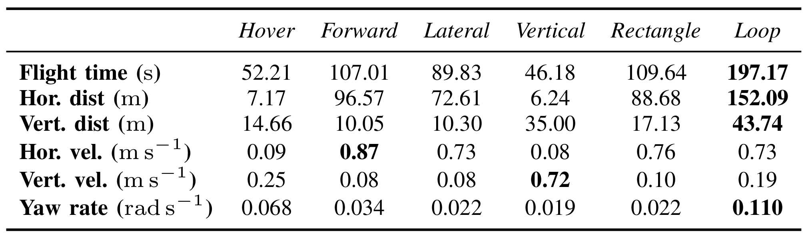

# MAS Datasets

Public datasets for research on state estimation based on motor angular speeds (MAS).
The datasets are open-sourced as part of our T-RO publication [1].
There are 6 datasets in total, each with a specific type of motion: *Hover, Forward, Lateral, Vertical, Rectangle, Loop*.

The rosbags contain unsynchronized LiDAR points, MAS, measurments, IMU measurements, and raw sensor data. 
Ground truth is provided via RTK GPS (Emlid Reach) INT FIX solution.

*If you use the datasets please cite our publication [1].*

There are two types of datasets:

- **raw**
  - raw LiDAR and IMU packets from Ouster OS0-128 LiDAR
- **processed**
  - IMU packets are converted to `sensor_msgs/Imu` topic
  - LiDAR packets are converted to `sensor_msgs/PointCloud2` topic
  - points with <0.5m range are removed 
  - the point cloud is downsampled to 16 rows
  - can be directly used in [MAS-LO](https://github.com/ctu-mrs/maslo)

| Loop                   | Rectangle                   |
| ---                    | ---                         |
|  |  |

## Publication

- [1] Petrlik, M.; Penicka, R.; Saska, M. *Motor Angular Speed Preintegration for Multirotor UAV State Estimation*, IEEE Transactions on Robotics (in review), 2024

## Download Datasets

- To download the datasets, run script `download_raw.sh` or `download_processed.sh`.
  - **Beware**, the datasets can be large!
  - All datasets will be downloaded into the `bag_files` directory.

## Requirements

- The [ouster_ros](https://github.com/ctu-mrs/ouster/) for interpreting the Ouster OS-128 LiDAR data in the **raw** datasets.
- The [mavros_msgs](https://github.com/mavlink/mavros) for interpreting the `mavros_msgs/ESCStatus` messages containing the MAS measurements.
- The [mrs_msgs](https://github.com/ctu-mrs/mrs_msgs) for interpreting the `mrs_msgs/RtkGps` messages containing the raw RTK data.

## Play the datasets

The `./example` folder contains example _tmux_ sessions that shows the recorded data in rviz.
Depending on whether you downloaded the **raw** or **processed** dataset, run `./example/raw/start.sh` or `./example/processed/start.sh`.
To change the played dataset change the `DATASET` variable in the beginning of the script to other dataset name.

## Sensors
| X500 Back               | X500 Front               |
| ---                     | ---                      |
|  |  |

- OS0-128 LiDAR (128 rows, 90 deg vFoV) (top-mounted):
  - LiDAR packets: `/os_lidar_packets` of type `ouster_ros/PacketMsg`
  - IMU: `/os_imu_packets` of type `ouster_ros/PacketMsg`
  - use the [ouster_ros](https://github.com/ctu-mrs/ouster/) to decode the packets into point cloud and IMU data (or use the **processed** dataset)
- Garmin Lidar Lite (down-facing rangefinder):
  - data: `/distance_sensor` of type `sensor_msgs/Range`
- Pixhawk4 FCU
  - MAS measurements: `/pixhawk_esc_status` of type `mavros_msgs/ESCStatus`
  - IMU measurements: `/pixhawk_imu` of type `sensor_msgs/Imu`
  - Magnetic field measurements: `/pixhawk_mag_field` of type `sensor_msgs/MagneticField`
  - Barometer pressure measurements: `/pixhawk_baro` of type `sensor_msgs/FluidPressure`
- MRS IMU 
  - Measurements `/mrs_imu` of type `sensor_msgs/Imu`
  - Acceleration, angular velocity (no orientation)
  - Connected to camera which was not recorded
- Emlid Reach RTK
  - Latitude, longitude, altitude measurements: `/rtk_raw` of type `mrs_msgs/RtkGps`
- Fused ground truth
  - More accurate: `/rtk_fused_odom` of type `nav_msgs/Odometry`
  - Less accurate: `/gps_fused_odom` of type `nav_msgs/Odometry`
  - GPS (RTK) fused with barometer, distance sensor, and IMU
   
## Frames

Sensor frames:
- baselink, pixhawk: `uav25/fcu`
- os_points: `uav25/os_lidar`
- os_imu: `uav25/os_imu`
- mrs_imu: `uav25/vio_imu`
- distance sensor: `uav25/garmin`

```
uav25/fcu
├───> uav25/os_sensor
│     ├───> uav25/os_lidar
│     └───> uav25/os_imu
├───> uav25/garmin
├───> uav25/vio_imu
```

If you get warning messages about missing transforms, there is a static transform publisher in `launch/static_tfs.launch` that will publish the necessary static TFs.

## Dataset parameters



